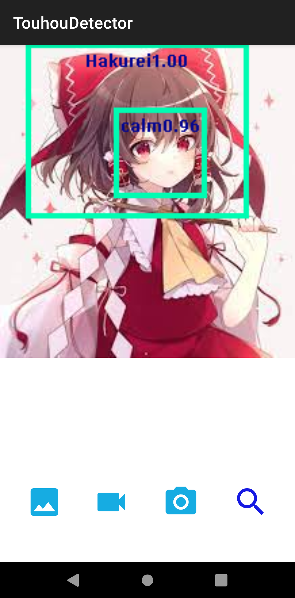

# TouhouDetector
YOLOv4 Tiny 192x192 on OpenCV Android

This model was trained with about 4000 images downloaded from zerochan and annotated myself.

While The AR feature was made with Vuforia Engine & Unity,and then exported the AAR to be used for this project.

Support List : Flandre,Hakurei,Marisa,Sanae,Yuomu,Patchouli,Remilia,Yuyuko,Sakuya,Nitori

## Features
### ImageDetect  demo
Select your photo from Goole Photos 

### CameraDetect  demo(mp4)
Open camera and start real-time touhou characters detection

### AR demo(mp4)
Once the AR Button is pressed ,it'll automatically crop the screenshot (Using bounding box from YOLOv4) and set the face as an ImageTarget in AR.

## Reference
https://github.com/hunglc007/tensorflow-yolov4-tflite

3D Models :    
AzureBerylBlue (deviantart):    
https://www.deviantart.com/azureberylblue/art/Touhou-FBX-3D-Model-Pack-88753973    
OrientalCrimsonMMD (deviantart):    
https://www.deviantart.com/orientalcrimsonmmd/art/MMD-Touhou-Montecore-styled-Nitori-Kawashiro-DL-647931224    
Danmaku Videos :    
flandre :      
https://www.youtube.com/watch?v=Tp9q_haJucA     
hakurei :      
https://www.youtube.com/watch?v=2M20yiTq1eE    
marisa :      
https://www.youtube.com/watch?v=tIS8nip1nIg    
sanae :       
https://www.youtube.com/watch?v=xDC5LHRz7fI    
youmu :         
https://www.youtube.com/watch?v=CzQ6E6s_mKM   
Patchouli :       
https://www.youtube.com/watch?v=ET7ZPAq_qGE   
remilia :      
https://www.youtube.com/watch?v=wmMDqub_UKA   
sakuya :       
https://www.youtube.com/watch?v=6o1dBMgZq_s   
nitori :       
https://www.youtube.com/watch?v=k4vMG5v0E2Y   
yuyuko :       
https://www.youtube.com/watch?v=w0vF-ixYAjY&t=202s   

